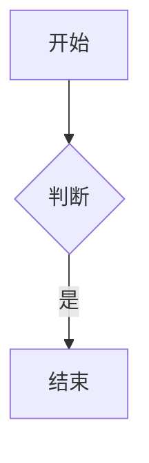

# ZCode 使用手册

本手册覆盖 ZCode 桌面端的核心能力：ZCode Agent 工作台、目标模式、浏览器自动化。

## 1.2 工作台入口

使用 ZCode Agent 时，可以在输入框中直接 @ 引用文件，使用 / 调用命令，通过 </code> 调用技能。

</p> <h4>不打开项目也能对话</h4> <p>有时候你只是想问个问题、让 Agent 帮忙算点东西或者起草一段文字，并不涉及某个代码仓库。</p> <ul> <li>这类对话里 Agent 创建的文件会留在磁盘上，关掉对话也不会自动清理。</li> <li>对话一旦发出就固定在这个模式里，想换成项目对话得新建一个。</li> </ul>

### 1.3 补充上下文

<table> <thead> <tr> <th>入口</th> <th>触发符号</th> <th>作用</th> </tr> </thead> <tbody> <tr> <td>提及</td> <td><code>@</code></td> <td>引用工作区中的文件或整个文件夹</td> </tr> </tbody> </table>

<blockquote> <p>提示：除上述入口外，输入框还支持 <code>@</code> 调用技能。</p> </blockquote>

## 快速开始（网页复制片段）

```xml
<dependency>
    <groupId>io.agentscope</groupId>
    <version>{agentscope.version}&lt;/version&gt;
```
</code></pre></div><blockquote>
<p><strong>Note</strong>：把 <code>{agentscope.version}</code> 替换为最新版本号即可。</p>
</blockquote>

<div class="code-block-wrapper"><div class="code-block-header"><span class="code-lang-label">java</span><button class="code-copy-btn" data-code="import%20io.agentscope.core.message.UserMessage%3B" title="复制代码"><span class="code-copy-text">复制</span></button></div><pre><code class="hljs language-java"><span class="hljs-keyword">import</span> io.agentscope.core.message.UserMessage;</code></pre></div>

## 图表与链接



```mermaid
这不是一个合法的 mermaid 图
```

[外链](https://example.com)
[相对路径](./other.md)
[锚点](#图表与链接)


<script>window.__xss=1</script>
